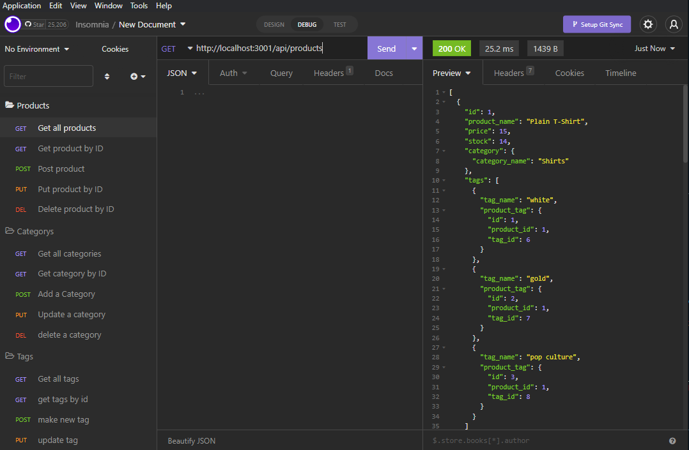

# E-Commerce Back End

[](https://opensource.org/licenses/MIT)

## Description

Using this app you will be able to sync to a datbase with a catergories, tags, and products tables. You can use the crud operations of get, put, post, and delete on any of these tables.

## Table of Contents (Optional)

- [Installation](#installation)
- [Usage](#usage)
- [Questions](#questions)

## Installation

To install necessary depenencies, run the follwing command:

```md
npm i

npm run seed

npm start
```

NOTE: Please use mysql workbench or command line to run the commands in the schema file(located in the db directory)



## Usage

Video on how to use: https://drive.google.com/file/d/1PVxFQ2fRLT_PO3YvQVTfWO7hqJcU6KKJ/view

To use this, use insomnia to run any of the routes using crud operations.

## How to Contribute

Feel free to fork the repo and contribute however you like!

## Tests

There are currently no tests for the repo

## Questions?

Reach out to me!

-GitHub: [HeyItsBradley](https://github.com/HeyItsBradley)

-Email: bradleyrodriguez77@gmail.com
